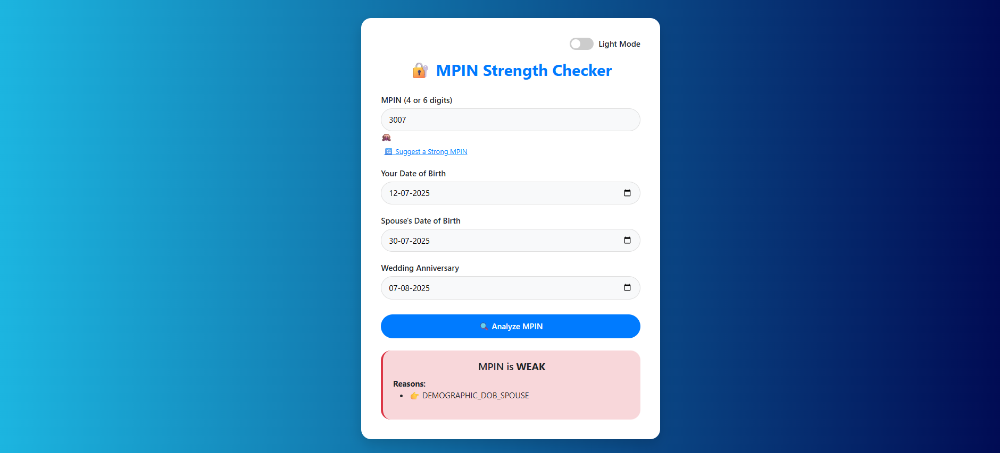

# 🔐 MPIN Strength Checker (AI-Powered Logic)

A smart, responsive React app that evaluates the strength of a user's MPIN based on personal data patterns and AI-style rule logic. 
---

## ✨ Features

- 🔍 Analyzes 4 or 6-digit MPINs
- 📅 Checks for similarity with DOB, spouse DOB, and anniversary
- 🧠 Detects common weak patterns (e.g. `1234`, `0000`, date-based pins)
- 🔄 Suggests strong, secure MPINs
- 👁️ Toggle visibility of MPIN (show/hide)
- 🌗 Dark/Light mode toggle
- 💻 Fully responsive, mobile-friendly UI
- 🎨 Custom styled with clean CSS

---

## 📸 Demo

Want to see how it looks? Here's a quick peek!  
 <!-- Replace this with your actual screenshot path -->

---

## 🚀 Getting Started

Follow these simple steps to get the project up and running on your local machine:

### 1. 📥 Clone the Repository

```bash
git clone https://github.com/shatakshisingh28/AI.git
cd AI

2. 🛠️ Install Dependencies
Make sure you have Node.js and npm installed.

npm install

3. 🚴 Run the App
npm start
The app will be live at http://localhost:3000

🧠 What This App Does
Analyzes your MPIN (4 or 6 digits) and checks:

If it's commonly used

If it's related to your personal dates (DOB, spouse DOB, anniversary)

Gives a clear human-friendly explanation on why your MPIN is considered weak or strong

Shows tips to make your MPIN more secure


🤝 Contributing
Pull requests are welcome! Feel free to fork the repo and submit improvements or bug fixes.
